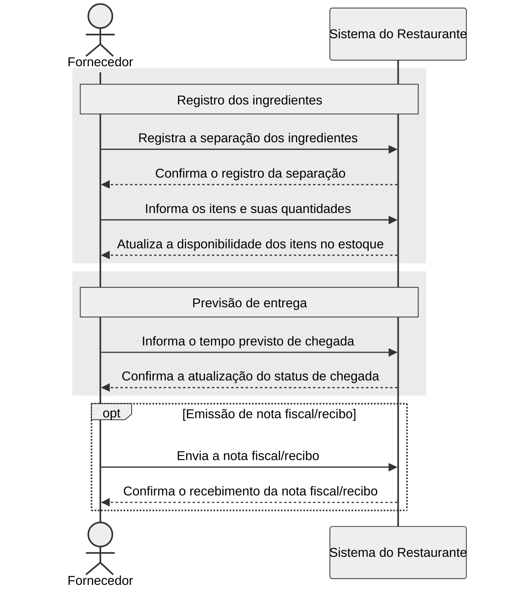

```mermaid
%%{init: {'theme':'base', 'themeVariables': {
    'background':'#ffffff',
    'primaryColor':'#e5e5e5',
    'primaryTextColor':'#000000',
    'primaryBorderColor':'#333333',
    'lineColor':'#333333',
    'textColor':'#000000',
    'actorBkg':'#eeeeee',
    'actorTextColor':'#000000',
    'actorBorder':'#333333',
    'signalColor':'#333333',
    'signalTextColor':'#000000',
    'labelTextColor':'#000000',
    'noteBkgColor':'#eeeeee',
    'noteTextColor':'#000000',
    'noteBorderColor':'#333333'
}}}%%

sequenceDiagram
    actor Fornecedor
    participant Sistema as Sistema do Restaurante

    rect rgb(235, 235, 235)
        Note over Fornecedor,Sistema: Registro dos ingredientes
        Fornecedor->>Sistema: Registra a separação dos ingredientes
        Sistema-->>Fornecedor: Confirma o registro da separação
        Fornecedor->>Sistema: Informa os itens e suas quantidades
        Sistema-->>Fornecedor: Atualiza a disponibilidade dos itens no estoque
    end

    rect rgb(235, 235, 235)
        Note over Fornecedor,Sistema: Previsão de entrega
        Fornecedor->>Sistema: Informa o tempo previsto de chegada
        Sistema-->>Fornecedor: Confirma a atualização do status de chegada
    end

    opt Emissão de nota fiscal/recibo
        Fornecedor->>Sistema: Envia a nota fiscal/recibo
        Sistema-->>Fornecedor: Confirma o recebimento da nota fiscal/recibo
    end
```
