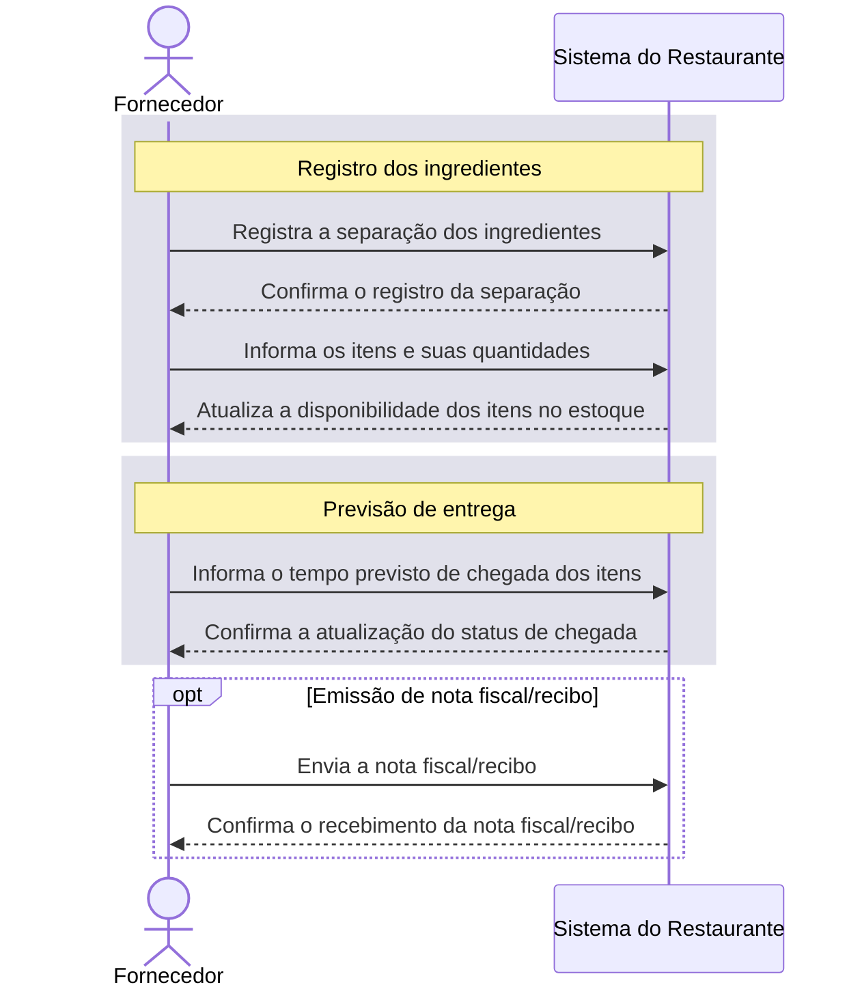

```mermaid
sequenceDiagram
    actor Fornecedor
    participant Sistema as Sistema do Restaurante

    rect rgb(225, 225, 235)
        Note over Fornecedor,Sistema: Registro dos ingredientes
        Fornecedor->>Sistema: Registra a separação dos ingredientes
        Sistema-->>Fornecedor: Confirma o registro da separação
        Fornecedor->>Sistema: Informa os itens e suas quantidades
        Sistema-->>Fornecedor: Atualiza a disponibilidade dos itens no estoque
    end

    rect rgb(225, 225, 235)
        Note over Fornecedor,Sistema: Previsão de entrega
        Fornecedor->>Sistema: Informa o tempo previsto de chegada dos itens
        Sistema-->>Fornecedor: Confirma a atualização do status de chegada
    end

    opt Emissão de nota fiscal/recibo
        Fornecedor->>Sistema: Envia a nota fiscal/recibo
        Sistema-->>Fornecedor: Confirma o recebimento da nota fiscal/recibo
    end
```
